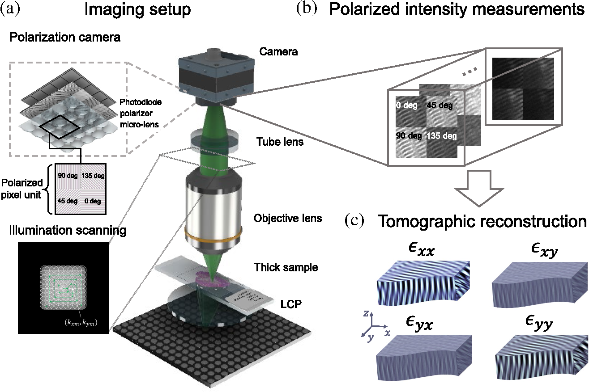

### Tensorial tomographic Fourier ptychography with applications to muscle tissue imaging

[Paper](https://doi.org/10.1117/1.AP.6.2.026004)

## Summary
We report tensorial tomographic Fourier ptychography (T2oFu), a nonscanning label-free tomographic microscopy method for simultaneous imaging of quantitative phase and anisotropic specimen information in 3D. Built upon Fourier ptychography, a quantitative phase imaging technique, T2oFu additionally highlights the vectorial nature of light. The imaging setup consists of a standard microscope equipped with an LED matrix, a polarization generator, and a polarization-sensitive camera. Permittivity tensors of anisotropic samples are computationally recovered from polarized intensity measurements across three dimensions. We demonstrate T2oFu’s efficiency through volumetric reconstructions of refractive index, birefringence, and orientation for various validation samples, as well as tissue samples from muscle fibers and diseased heart tissue. Our reconstructions of healthy muscle fibers reveal their 3D fine-filament structures with consistent orientations. Additionally, we demonstrate reconstructions of a heart tissue sample that carries important polarization information for detecting cardiac amyloidosis.

*Figure 1. Workflow of the proposed method. (a) An illustration of T2oFu’s experimental setup. Green light from an addressable LED array is circularly polarized with a left circular polarizer to illuminate the sample. Sequential illuminations from various angles are used to scan the object in the spatial frequency domain. The sample is then imaged with an infinity-corrected optical system. The polarized light intensities at 0 deg, 45 deg, 90 deg, and 135 deg are recorded with a polarization-sensitive CMOS camera as images illustrated in (b). (c) Those intensity measurements are then fused to form volumetric sample permittivity tensor reconstructions by solving the corresponding inverse problem.*

## Muscle Fiber Assessment
High-contrast and high-resolution structural imaging of intrinsic signals in muscle skeletal fibers is an important task for the rapid detection of changes in myofibrillar organization that can lead to skeletal myopathies. Currently, 3D muscle tissue is typically imaged by complex and expensive systems, such as second-harmonic generation (SHG) microscopy. SHG exploits the contrast of polarization properties from the nonlinear susceptibility in molecules like myosin, by using high-power, ultrashort pulsed lasers in a point scanning configuration. Here we show 3D T2oFu, reconstruction results of an isolated healthy muscle fiber using our inexpensive, LED-based, and scanning-free system, which generally shows similar results as described for SHG imaging in the literature. Figure 2(a) shows an image of a muscle fiber captured with center LED illumination. Figure 2(b) shows a volumetric reconstruction of the muscle fiber. The cross sections of regions highlighted in Fig. 2(a) are depicted. Figure 2(c) shows an image of the same muscle fiber from a different field of view, where a non-muscle fiber with a 90 deg bend is placed below the muscle fiber. Figure 2(d) depicts reconstructed orientation and birefringence at two different depths, showing the regular pattern of a healthy muscle fiber. The zoom-in region highlights the muscle grains with consistent orientations, in agreement with the results reported by Both et al. The reconstruction shows a change in orientation at the bend of the non-muscle fiber [Fig. 2(d1)], while the orientation of the muscle fiber remains constant. Furthermore, the spatial resolution of the reconstruction is sufficient to clearly resolve the muscle filaments [Fig. 2(d3)]. Figure 2(e) shows a histogram of orientation of the reconstruction shown in Fig. 2(d), indicating two different types of cells.

*Figure 2. Reconstructions of a muscle fiber. (a) The image of a muscle fiber with the center LED illumination. The imaging system is focused in the middle of the muscle fiber. (b) The reconstructed birefringence. The zoom-in region resembles the structures of healthy muscle fibers reported in literature. (c) The image of the same muscle fiber at a different region, where a non-muscle fiber with a 90-deg bend is placed below the muscle fiber [see panel (d1)]. The imaging system is focused between this and the muscle fiber. (d) The reconstructed orientation at different depths, with a zoom-in showing the fine sarcomere structure of muscle tissue. (e) Histogram of reconstructed orientation shown in (d).*

## Muscle Fiber Assessment
Additionally, we apply our method to image a heart tissue sample that has cardiac amyloidosis. Cardiac amyloidosis is a lethal disease that affects <12,000 patients in the US alone, with a < 5 % 10-year survival rate. In current practice, the biopsied tissue is first frozen and thinly sliced, then stained with a congo red-colored dye, and inspected under a cross-polarized microscope. Figure 3(a) shows the bright-field image. Figure 6(b) shows the same region, imaged with a cross-polarized color microscope. The vibrant apple green color suggests mostly likely amyloid protein has built up inside the tissue sample. Figures 3(c) and 3(d) depict the reconstructed refractive index and birefringence, while zoom-ins of the boxed region are shown in Figs. 3(e)–6(h). Figures 3(e) and 3(g) show lateral slices at different depths, while Figs. 3(f) and 3(h) show cross sections of the region highlighted with dashed lines in Figs. 3(c) and 3(d). Since the sample is thinly sliced, we do not observe noticeable structural changes in different layers. However, the structure of the birefringence reconstruction is correlated with the color-stained cross-polarized image, which could potentially be useful for rapid on-site inspections in the future.

*Figure 3. Images of a heart tissue sample with cardiac amyloidosis. (a) A brightfield image. (b) A cross-polarized image was taken with a color microscope. (c) and (d) Reconstructed refractive index and birefringence, along with zoom-ins of the boxed region depicted in (e)–(h). (e) and (g) Lateral slices at different depths; (f) and (h) cross sections of the region highlighted with dashed lines in (c) and (d). Panels (c), (e) and (f) share the same color bar, while (d), (g), and (h) share another common color bar.*

## Code
Due to pending invention disclosure, the code underlying the results presented in this work is not publicly available at this time but may be obtained from the authors upon reasonable request for non-commercial use.
